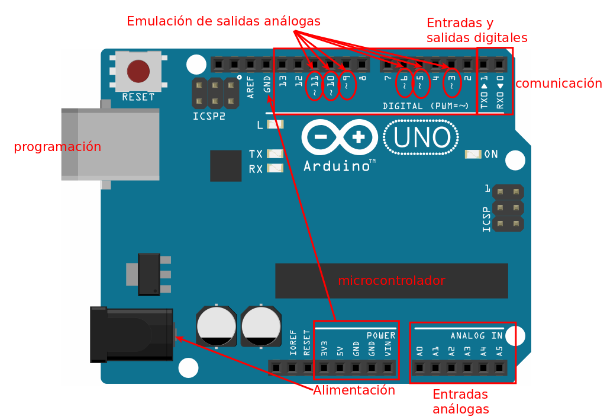
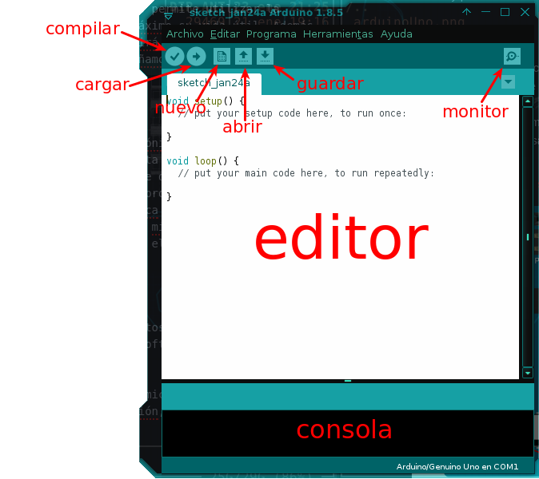
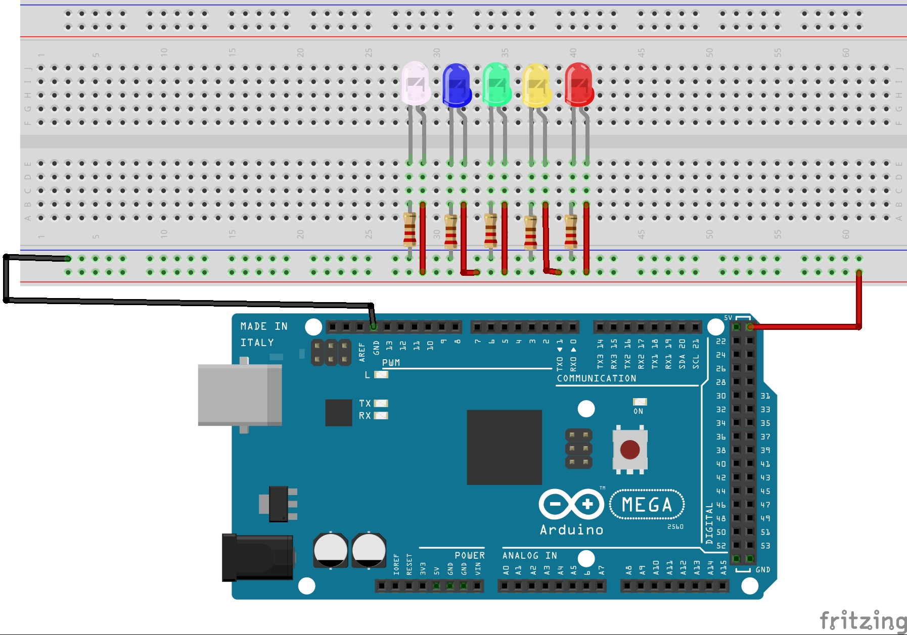

# Lección 3 - Introducción

**2 sesiones: 1 hora / sesión**

<!-- TOC -->

- [Lección 3 - Introducción](#lecci%C3%B3n-3---introducci%C3%B3n)
  - [¿Qué es la electrónica digital?](#%C2%BFqu%C3%A9-es-la-electr%C3%B3nica-digital)
  - [¿Qué es Arduino?](#%C2%BFqu%C3%A9-es-arduino)
  - [Probador de leds](#probador-de-leds)
    - [Objetivo](#objetivo)
    - [Materiales](#materiales)
    - [Antes de empezar](#antes-de-empezar)
    - [Montaje 0](#montaje-0)

<!-- /TOC -->

## ¿Qué es la electrónica digital?

La electrónica digital es la parte de la electrónica que se encarga del tratamiento binario (0-1) de la información. Esta característica le permite a la electrónica digital ser susceptible de programación mediante álgebra booleana y códigos binarios lo cual le proporciona una potencia extra para el análisis de señales. La electrónica digital, gracias al avance en el desarrollo de microcontroladores y micropocesadores es una ciencia que permite cada dia mayor precisión en el tratamiento y procesamiento informático de la información.

Leer más en [wikipedia en español: Electrónica digital][1]

## ¿Qué es Arduino?

Arduino es un sistema de construcción de circuitos de electrónica digital conformado por una hardware (el circuito), un software (IDE) y una comunidad mundial de desarrolladores (makers).

El **hardware** es una placa conformada por un microcontrolador programable y un sistema de pines de alimentación, entrada, salida y emulación de señales análogas.

El **software** es un IDE de programación basada en processing desde el cual se ejecuta el proceso de _cross compilation_ o compilación en cruz. Debido a que el hardware de Arduino no tiene la capacidad para aceptar conexiones de dispositivos tales como teclado y pantalla, el proceso de programación del compilador debe ejecutarse en otro computador y luego cargado el resultado de la compilación del código en el microcontrolador, a este proceso se le denomina _cross compilation_.

La **comunidad** esta conformada por todos quienes integramos el movimiento _maker_ (hágalo usted mismo). Un grupo de personas que a nivel mundial destaca por su interés en aprender a hackear la electrónica digital.

## Probador de leds

Un primer ejercicio será utilizar Arduino como batería para comprobar que tus leds estén funcionando correctamente.

### Objetivo

Utilizar Arduino como una batería de 5 volts para probar leds. Este ejercicio no requiere de programación. Al alimentar Arduino mediante USB, utilizar los 5 volts de salida que da la placa para encender mínimo un LED. Puede probar más LEDs a la vez, este ejemplo se ha desarrollado para 5 LEDs.

### Materiales

- Placa Arduino
- Protoboard
- Resistencias de 220 Ohm (una por cada led)
- Jumpers
- LEDs

### Antes de empezar

- [Lee acerca de los LEDs en la Wikipedia][2]
- [Lee acerca del código de colores en la Wikipedia][3] para que aprendas a calcular el valor de las resistencias.
- [Electrodroid][4] es una aplicación para Android que te permitirá calcular resistencias y todo lo relacionado con tus montajes.

### Montaje 0

Asegurate de que el **anodo** (la terminal más larga) de cada LED este conectado a la línea de alimentación de 5 volts y el **cátodo** a la línea de tierra, si inviertes la polaridad del diodo no encenderá el LED.

Tu primer montaje esta listo, si conectas ahora tu Arduino al puerto USB de tu PC verás cómo los LEDs encienden, a menos que estén dañados.

[1]:https://es.wikipedia.org/wiki/Electrónica_digital
[2]:https://es.wikipedia.org/wiki/Led
[3]:https://es.wikipedia.org/wiki/Codificación_de_colores
[4]:https://play.google.com/store/apps/details?id=it.android.demi.elettronica
