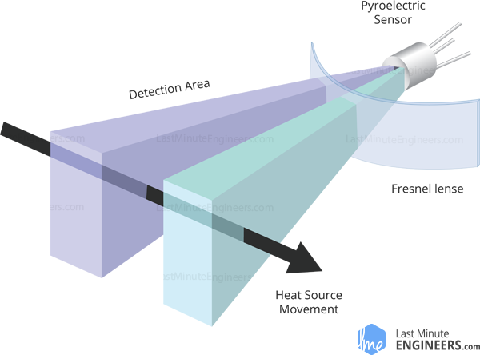
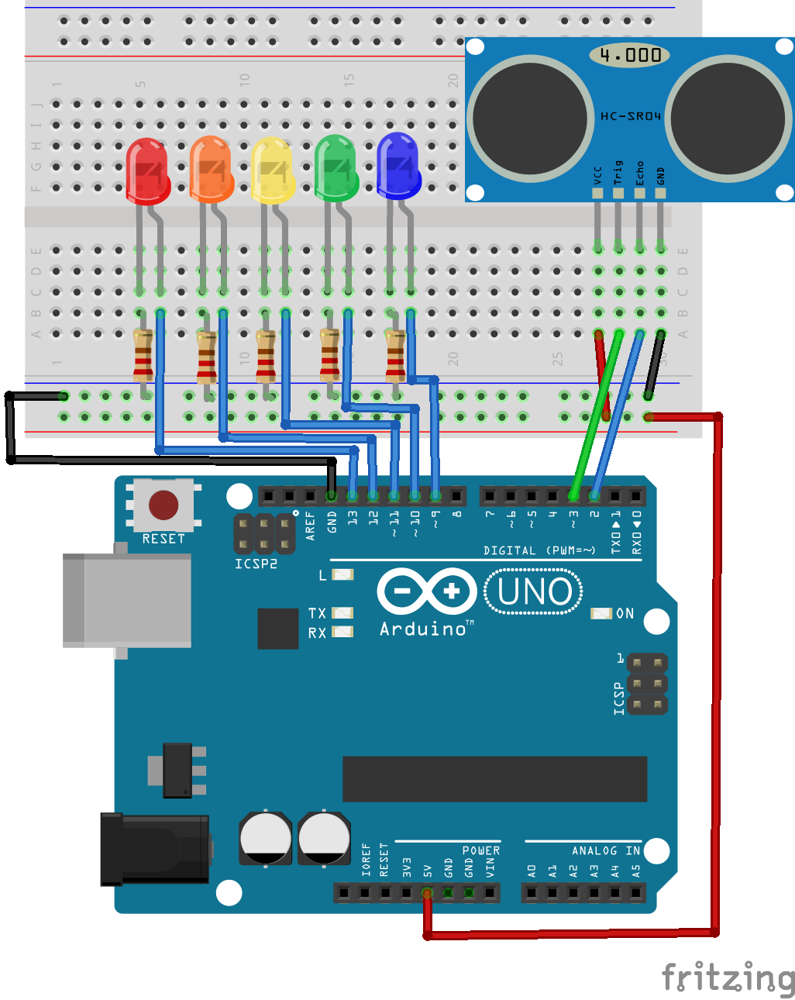

# Lección 4 - sensores

**2 Sesiones: 1 hora / sesión**

<!-- TOC -->

- [Lección 4 - sensores](#lecci%C3%B3n-4---sensores)
  - [Montaje 1 - Sensor Infrarrojo Pasivo (PIR)](#montaje-1---sensor-infrarrojo-pasivo-pir)
    - [Objetivo](#objetivo)
    - [¿Cómo funciona el sensor PIR?](#%C2%BFc%C3%B3mo-funciona-el-sensor-pir)
    - [Sensor HC_SR501 PIR](#sensor-hc_sr501-pir)
    - [Controla un LED con el sensor HC_SR501 PIR](#controla-un-led-con-el-sensor-hc_sr501-pir)
      - [Materiales](#materiales)
      - [El código](#el-c%C3%B3digo)
  - [Montaje 2 - Sensor HC-SR04 Ultrasónico](#montaje-2---sensor-hc-sr04-ultras%C3%B3nico)
    - [Sensor de parqueo con LEDs](#sensor-de-parqueo-con-leds)
      - [Materiales](#materiales-1)
      - [El código](#el-c%C3%B3digo-1)
  - [Referencias](#referencias)

<!-- /TOC -->

Los sensores (digitales y análogos) en la electrónica digital son un recurso muy utilizado debido a su versatilidad y funcionalidad para desarrollar aplicaciones interactivas (IoT) con el contexto.

## Montaje 1 - Sensor Infrarrojo Pasivo (PIR)

### Objetivo

El sensor HC_SR501 Sensor Infrarojo Pasivo (PIR por sus siglas en inglés) es utilizado ampliamente en sistemas de seguridad o para el encendido automático de luces. Algunas ideas en las que puedes emplear un sensor PIR son:
- Para encender las luces de las escaleras del edificio donde vives.
- Para enviar un mensaje a tu celular alertándote de que alguien a abierto tu closet en tu ausencia.
- Para abrir la puerta del dispensario de comida cuando tu mascota se acerque a su plato.

En este montaje utilizarás un sensor PIR para encender un LED cuando algo se mueva cerca del montaje.

### ¿Cómo funciona el sensor PIR?



Todos los cuerpos con una temperatura superior al cero absoluto emiten energía calórica en forma de radiación infraroja. A mayor temperatura del cuerpo más será la cantidad de radiación que emita. El sensor PIR esta especialmente diseñado para detectar tales radiaciones.

El sensor HC_SR501 PIR básicamente esta conformado por un sensor piroeléctrico y una lente de Fresnel que se encarga de concentrar los rayos infrarojos en el sensor piroeléctrico.

El sensor piroeléctrico esta conformafo por dos *slots* que producen radiación infraroja positiva y negativa respectivamente de tal forma que se anulan mutuamente, esto es así debido a que se busca detectar las emisiones de radiación infraroja no la radiación presente en el ambiente. Cuando uno de los *slots* detecta un incremento o decremento en la radiación infraroja respecto del otro *slot* el sensor habrá detectado movimiento.


### Sensor HC_SR501 PIR

El sensor HC_SR501 PIR tiene tres pines de conección GND, Salida Digital y VCC. El voltage de operación de este sensor esta entre 4.5 y 12 volts con lo que a 5 volts (voltaje de salida de Arduino) funciona adecuadamente.


El sensor HC_SR501 PIR cuenta con dos potenciometros que ajustan el grado de **Sensibilidad** o la distania a la que el movimiento puede ser detectado en un rango de 3 a 7 metros aproximadamente. La forma de la habitación en la que se encuentre el sensor puede afectar su desempeño; el segundo potenciometro ajusta el **Tiempo** que permanecerá el estado HIGH en la salida digital, este tiempo se ajusta en un rango de 3 a 500 segundos.

### Controla un LED con el sensor HC_SR501 PIR

#### Materiales

- 1 Sensor HC_SR501 PIR
- 1 Resistencia de 220 Ohm
- 1 LED
- Jumpers

En este montaje usarás un LED para indicar visualmente cuándo el sensor HC SR501 PIR ha detectado movimiento. Conecta los componentes como se muestra en la figura.


El OUT del sensor esta conectado a un pin digital de Arduino y en este montaje el ánodo del diodo no esta conectado directamente a los 5 volt sino que recibirá el voltaje a través de un pin digital de Arduino que se configurará como salida digital.

#### El código

```
const int sensorPin = 12;
const int ledPin = 13;

void setup(){
  pinMode(sensorPin, INPUT);
  pinMode(ledPin, OUTPUT);
}

void loop(){
  if (digitalRead(sensorPin) == HIGH){
    digitalWrite(ledPin, HIGH);
  }else {
    digitalWrite(ledPin, LOW);
  }
}
```
*El código de cada uno de los montajes de ejemplo lo encuentras en [el directorio code][2]*

El sensor HC_SR501 PIR requiere de un tiempo de *"aclimatación"* para leer correctamente la energía infraroja de la habitación. Después de encendido el sensor tomará entre 30 y 60 segundos en adaptarse correctamente al ambiente.

Adicionalmente este sensor tiene un tiempo de **reset** después de hacer una lectura, entre 5 y 6 segundos después de detectar movimiento el sensor no hará ningúna nueva detección.

Estos tiempos deben tomarse en cuenta al momento de utilizar este sensor en nuestros montajes.

## Montaje 2 - Sensor HC-SR04 Ultrasónico

Incluir un radar o el poder de ubicación de un murciélago en tu próximo proyecto con Arduino es muy fácil utilizando el sensor ultrasónico HC_SR04. Este sensor que opera a 5 volts y 15mA emite pulsos de ultrasonido de 40 KHz cubriendo un ángulo de 15 grados, tiene un rango de detección de 2 a 400 cm con una precisión de 3mm.


El ultrasonido corresponde a ondas sonoras por sobre los 20000 Hz y por tanto no son percibidos por el oído humano.

El sensor HC_SR04 tiene dos transductores ultrasónicos, uno actua como emisor que convierte una señal eléctrica de 5 volts en un pulso ultrasónico de 40 KHz, el otro es el receptor. Si éste recibe un ultrasonido en esta frecuencia produce un *pulso* que puede ser utilizado para determinar la distancia recorrida por la onda ultrasónica emitida.

Una vez un pulso de voltaje de al menos 10 microsegundos aplicado al pin Trig pin éste emite un tren de 8 pulsos ultrasonido de 40 KHz. Este tren de 8 pulsos es la "firma" que identifica al emisor de tal forma que el receptor no se confunda con los posibles ultrasonidos presentes en el ambiente. Mientras tando el pin Echo se activará en HIGH esperando durante 38 milisegundos un pulso de retorno, si a lo largo de estos 38 milisegundos no hay un pulso de retorno (no hay obstáculo frente al sensor) el pin Echo vuelve a estado LOW mientas se emite un nuevo tren de pulsos.


Si hay una señal de retorno, el sensor pasará a estado LOW tanto tiempo como dure el pulso entrante, este pulso tiene una duración de entre 150 microsegundos y 25 milisegundos. La longitud del pulso recibido se utilizará para calcular la distancia al obstáculo.


Para determinar la distancia al obstáculo, conociendo la duración del pulso entrante utilizamos la fórmula de la distancia d = tv donde v es la velocidad del sonido dada en cm / microsegundos i.e. 0.034 cm / microsegundos, y t es la duración del pulso entrante. Debes recordar que la distancia recorrida por el pulso es el doble de la distancia al objeto ya que se habrá medido la distancia de ida y regreso por tanto la distancia real al objeto será d = (0.034 t) / 2.

### Sensor de parqueo con LEDs

Ahora que ya sabes cómo funciona el sensor HC_SR04 puedes construir tu propio sensor de parqueo que consistirá de un sensor HC_SR04 y 5 LEDs que se irán encendiendo a medida que te aproximes a un obstáculo.

#### Materiales

- 1 Sensor HC_SR04
- 5 LEDs
- 5 Resistencias 220 Ohm
- Jumpers



#### El código
```
const int echoPin = 2;
const int trigPin = 3;

float duration, distance;

void setup() {
  pinMode(echoPin, INPUT);
  pinMode(trigPin, OUTPUT);

  // LEDs
  for (int i = 9; i < 14; i++) {
    pinMode(i, OUTPUT);
  }
}

void loop() {
  digitalWrite(trigPin, LOW);
  delayMicroseconds(2);

  digitalWrite(trigPin, HIGH);
  delayMicroseconds(10);
  digitalWrite(trigPin, LOW);

  duration = pulseIn(echoPin, HIGH);

  distance = 0.034 * duration / 2;

  int leds = detection(distance);

  switch (leds) {
    case 1:
      digitalWrite(9, HIGH);
      for (int i = 10; i < 14; i++) {
        digitalWrite(i, LOW);
      }
      break;
    case 2:
      for (int i = 9; i < 11; i++) {
        digitalWrite(i, HIGH);
      }
      for (int i = 11; i < 14; i++) {
        digitalWrite(i, LOW);
      }
      break;
    case 3:
      for (int i = 9; i < 12; i++) {
        digitalWrite(i, HIGH);
      }
      for (int i = 12; i < 14; i++) {
        digitalWrite(i, LOW);
      }
      break;
    case 4:
      for (int i = 9; i < 13; i++) {
        digitalWrite(i, HIGH);
      }
      digitalWrite(13, LOW);
      break;
    case 5:
      for (int i = 9; i < 14; i++) {
        digitalWrite(i, HIGH);
      }
      break;
    default:
      for (int i = 9; i < 14; i++) {
        digitalWrite(i, LOW);
      }
  }
}

int detection(float d) {
  int ledIndicator = 0;
  if (d < 5) {
    ledIndicator = 5;
  } else if (d > 5 && d < 10) {
    ledIndicator = 4;
  } else if (d > 10 && d < 15) {
    ledIndicator = 3;
  } else if (d > 15 && d < 20) {
    ledIndicator = 2;
  } else if (d > 20) {
    ledIndicator = 1;
  }

  return ledIndicator;
}
```
## Referencias

1. [How HC-SR501 PIR Sensor Works & Interface It With Arduino][1]
2. [How HC_SR04 Ultrasonic Sensor Works & Interface It With Arduino][3]

[1]:https://lastminuteengineers.com/pir-sensor-arduino-tutorial/
[2]:https://github.com/piratax007/arduino_course/tree/master/Code
[3]:https://lastminuteengineers.com/arduino-sr04-ultrasonic-sensor-tutorial/
