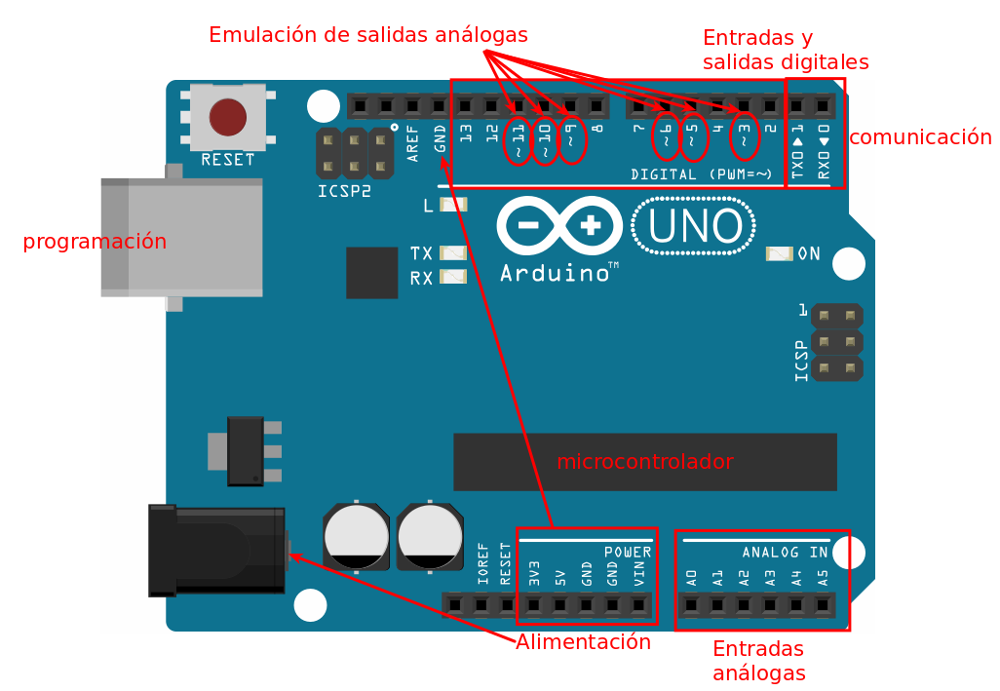

# Tecnologías Creativas en el Aula - Arduino

## Introducción

### ¿Por qué aprender electrónica digital con Arduino?

Día a día el número de dispositivos tecnológicos disponibles aumenta de manera quasi exponencial y todos estos nuevos dispositivos son electrónica digital (0-1). La presencia de computadora ha pasado de una extraña y escasa aparición en los centro de investigación a ser prácticamente ubicua a tal punto que al parecer hemos empezado a olvidar que la mayoría de nuestras acciones las realizamos en interacción con dispositivos electrónicos. Lo anterior sumado al ambiental de la producción de más y más electrónica y a los planes de obsolescencia programada con los que los fabricantes sacan al mercado sus dispositivos hacen que el aprender electrónica digital ya no sea una tarea limitada a los ingenieros y hackers en tecnología sino que se ha convertido en una responsabilidad social ya que este conocimiento permite utilizar la tecnología de forma adecuada aprovechando al máximo su vida útil. Además, saber de electrónica digital también te permitirá hacer parte de la construcción de ese futuro con el que todos soñamos pero que pocos se preguntan cómo llegará a ser realidad.

### Pero ¿qué es la electrónica digital?

La electrónica digital es la parte de la electrónica que se encarga del tratamiento binario (0-1) de la información. Esta característica le permite a la electrónica digital ser susceptible de programación mediante álgebra booleana y códigos binarios lo cual le proporciona una potencia extra para el análisis de señales. La electrónica digital, gracias al avance en el desarrollo de microcontroladores y micropocesadores es una ciencia que permite cada dia mayor precisión en el tratamiento y procesamiento informático de la información.

### ¿Qué es Arduino?

Arduino es un sistema de construcción de circuitos de electrónica digital conformado por una hardware (el circuito), un software (IDE) y una comunidad mundial de desarrolladores.

El **hardware** es una placa conformada por un microcontrolador programable y un sistema de pines de alimentación, entrada y salida y emulación de señales análogas.

El **software** es un IDE de programación basada en processing desde el cual se ejecuta el proceso de _cross compilation_ o compilación en cruz. Debido a que el hardware de Arduino no tiene la capacidad para aceptar conexiones de dispositivos tales como teclado y pantalla, el proceso de programación del compilador debe ejecutarse en otro computador y luego cargado la compilación del código en el microcontrolador, a este proceso se le denomina _cross compilation_.

La **comunidad** esta conformada por todos quienes integramos el movimiento _maker_ (hágolo usted mismo). Un grupo de personas que a nivel mundial destaca por su interés en aprender a hackar la electrónica digital.

### ¿Qué aprenderé?

1. Prototipado
  1. Breadboard
  2. Diseño de circuitos (Fritzing)
  3. Quemado de PCB
  4. Soldadura
2. LEDS, pulsadores, potenciometros, rotary encoder.
3. Sensores
4. Motores
5. Comunicación serial

### Mecánica de juego

A medida que transcurran las lecciones encontrarás nuevos retos que pondrán en juego diferentes habilidades que debes desarrollar solo o trabajando en equipo - recuerda el prototipado no solo se trata de escribir código. Verás cómo mientras aprendes a programar te convertirás en
- _HACKER_ : Un maestro del desarrollo de código.
- _PIONEER_ : La mente más creativa e innovadora.
- _ACHIEVER_ : Aceptarás cualquier reto con tal de conseguir el mayor puntaje.

Podrás concentrarte en alcanzar el máximo nivel en uno de estos roles o podrás desarrollar habilidades de todos que te hagan un programador con capacidad de ocupar cualquier roll que sea necesario. El juego se desarrollará en cuatro etapas, para superar cada etapa deberás alcanzar mínimo 60 puntos que acumularas ganando medallas de cualquiera de los roles.

#### MISIÓN AVATAR

Utilizando una herramienta como [avatarmaker][1] desarrolla tu propio avatar con fondo transparente. Recibirás estas tres medallas personalizadas.

#### MISIÓN CUBE

Construye un cubo de 64 leds de acuerdo a [esta guía][2].

Tus compañeros votarán por el cubo con más recorridos de encendido - apagado diferentes, el cubo que más puntos reciba ganará el mismo número de puntos _HACKER_. También votarán por el diseño más creativo, el cubo que reciba más puntos ganará el mismo número de puntos _PIONEER_. El _ACHIEVER_ del equipo que gane una o las dos de estas menciones obtendrá 10 puntos _ACHIEVER_ adicionales.

[1]: http://avatarmaker.com/
[2]: https://github.com/piratax007/arduino_course/blob/master/Documentos/cube_guide.pdf
